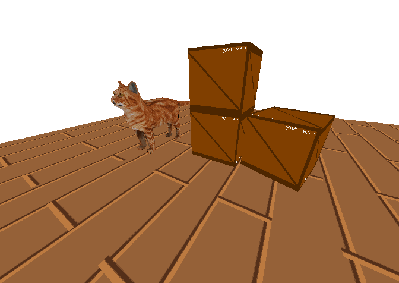

# SoftwareRenderer
A software renderer written in C++.
It allows real time rasterization of .obj models.



## The graphics pipeline

* **View space conversion** using self-implemented linear algebra classes
* **Backface culling**
* **Clip space projection** in homogenous coordinates
* **Frustum culling and clipping**
* **Rasterization** using a modified Bresenham’s algorithm
* **Texturing** perspective correct

## Controls
WSAD to move, MOUSE to look, SPACE and SHIFT to control height.
Objects displayed are currently loaded and positioned at the beginning of main.

## Building 
To build this project you'll need SDL2, and you'll have to build it on linux.

```bash
# Debug Build
make

# Release Build (Optimized)
make RELEASE=1

# Run
./build/main 